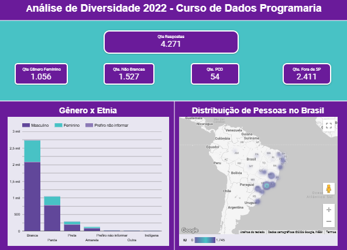

# Análise de Diversidade 2022 - DataHackers - Curso de Dados - Programaria 2026

# Dashboards - Loocker Studio

Os dashboards deste projeto foram desenvolvidos no **Looker Studio (antigo Data Studio)** a partir da base de dados da pesquisa de **Análise de Diversidade 2022 da DataHackers**.

A planilha utilizada como fonte de dados para os dashboards é **Análise de Diversidade 2022 - DataHackers** disponível no Google Sheets:

[Análise de Diversidade 2022 - DataHackers](https://docs.google.com/spreadsheets/d/1TMZNtx7xLOQnAa_riLET2ptqhNcWE8VJgSMxgeyhjPM/edit?usp=drive_link)

Construímos painéis interativos com análises de:

- Gênero x Etnia
- Distribuição de pessoas por região do Brasil
- Etnia x Senioridade
- Média salarial por etnia
- Gênero x Nível de Escolaridade
- Gênero x Senioridade
- Média salarial por gênero
- Etnia x Nível de Escolaridade

O dashboard completo pode ser acessado no link abaixo:

**Dashboard interativo no Looker Studio:**  

[Análise de Diversidade 2022 - Curso de Dados Programaria](https://datastudio.google.com/reporting/476296a9-fcef-4a5e-9493-19715d4f6048)

### Visão geral da análise

